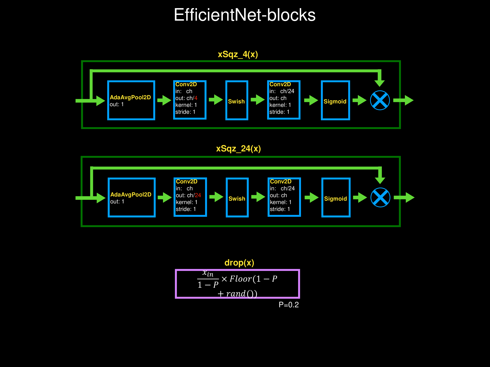
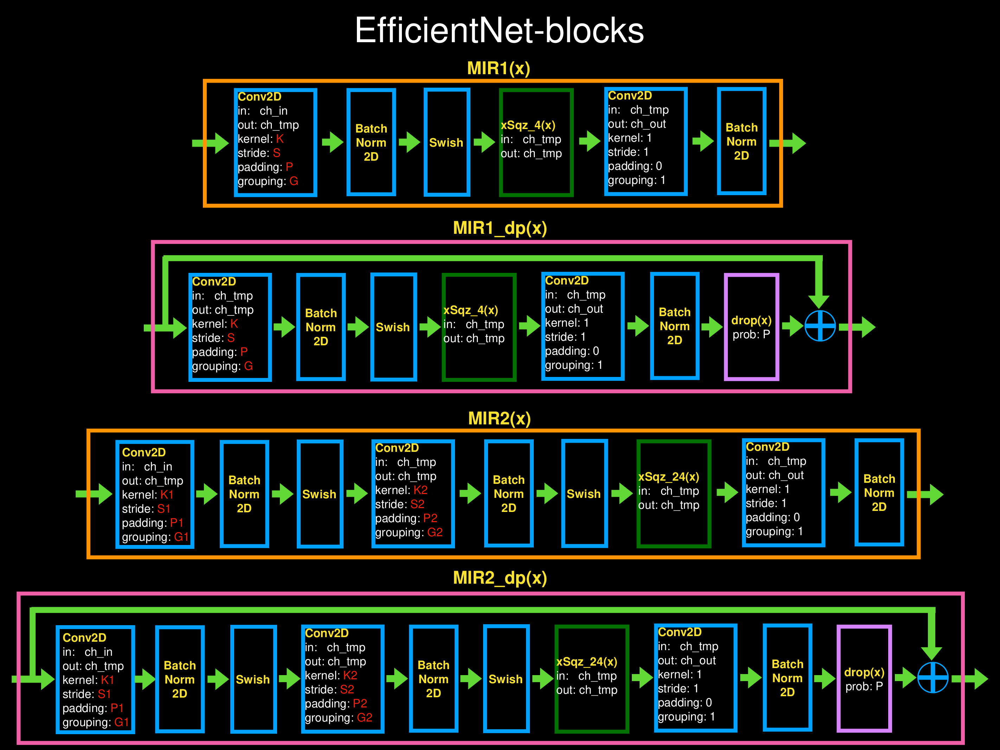
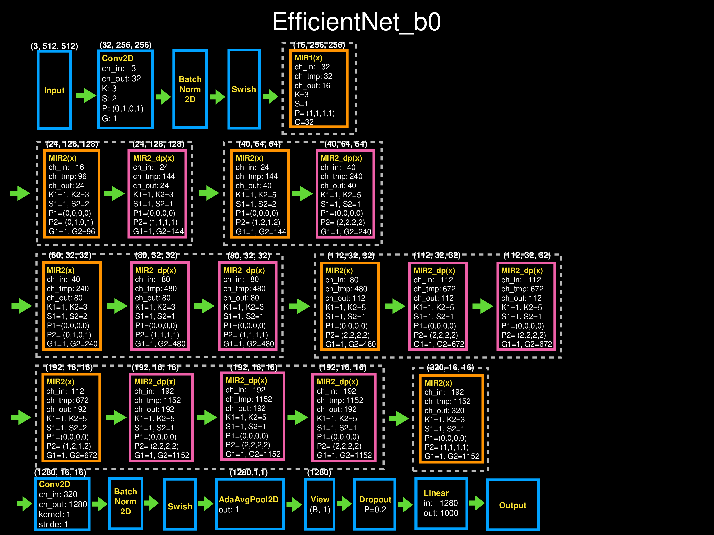
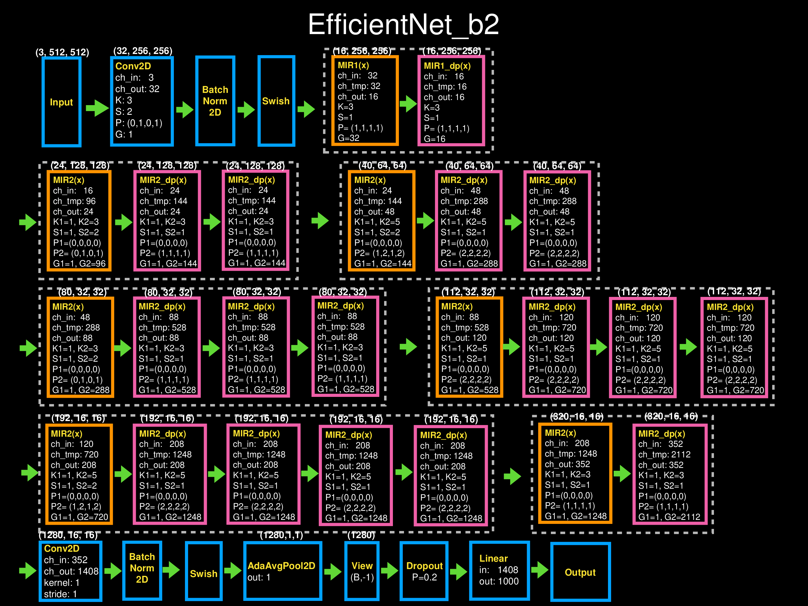
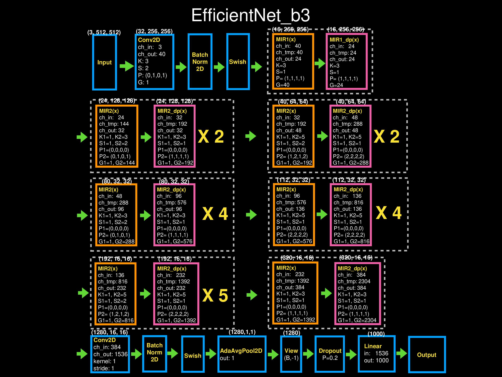
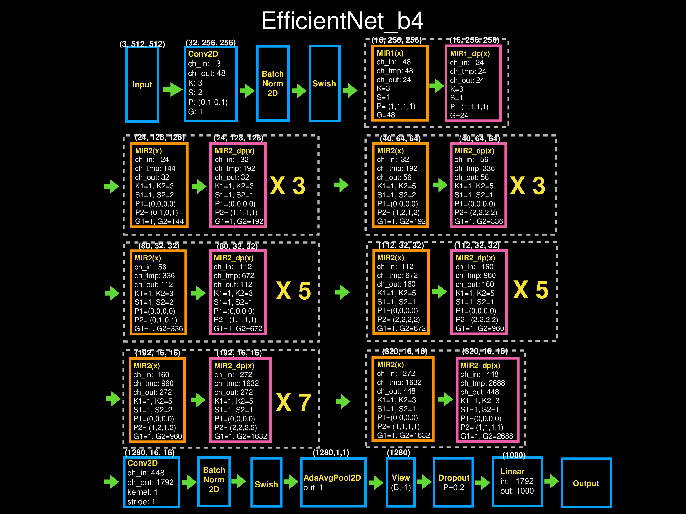
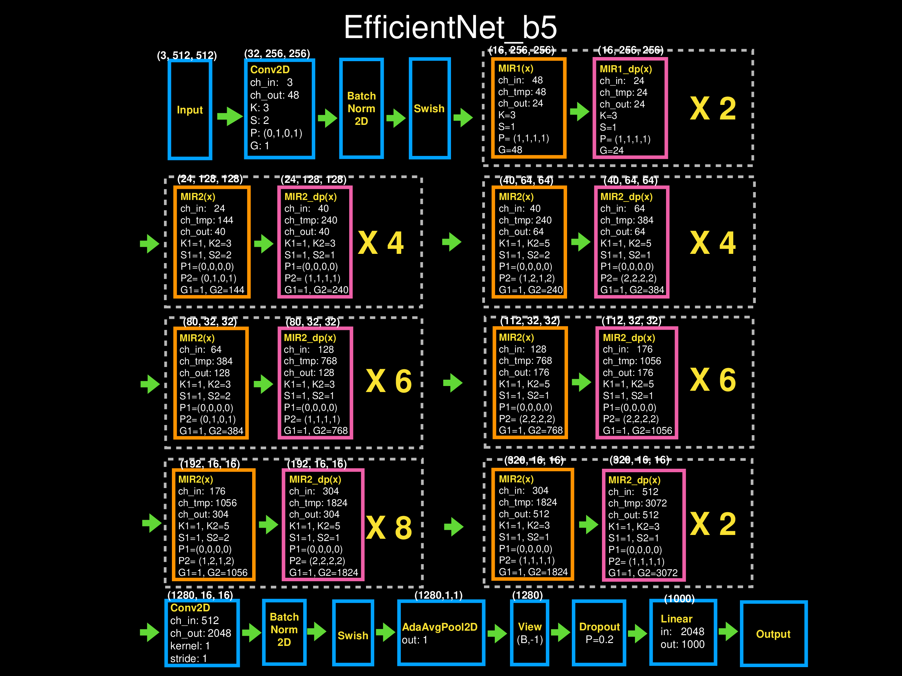
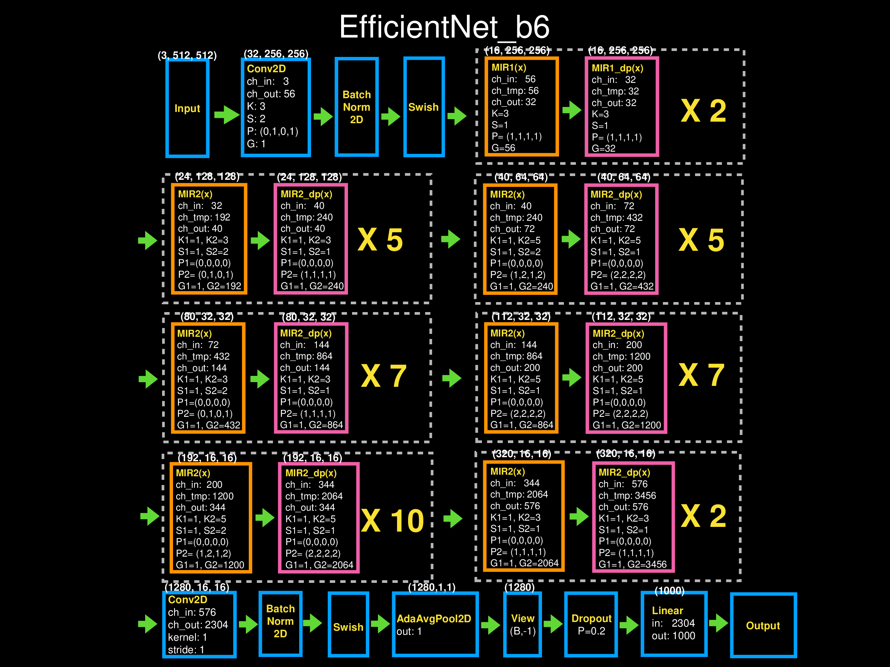
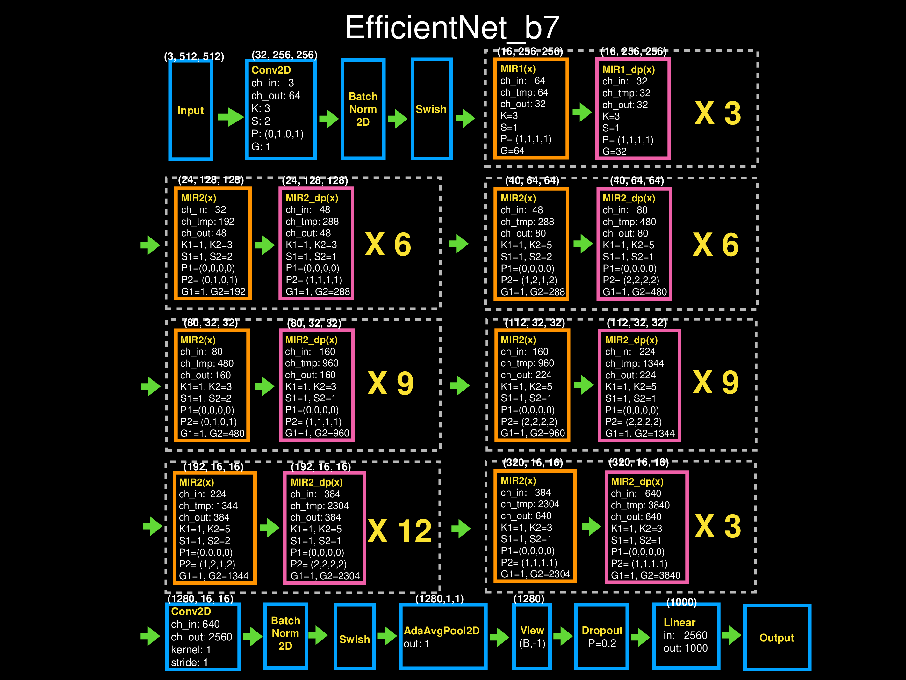

# Efficientnet Models
###
###### 之前做的整理
## Efficientnet Blocks

***
## Efficientnet_b0

***
## Efficientnet_b1

***
## Efficientnet_b2

***
## Efficientnet_b3

***
## Efficientnet_b4

***
## Efficientnet_b5

***
## Efficientnet_b6

***
## Efficientnet_b7

***
